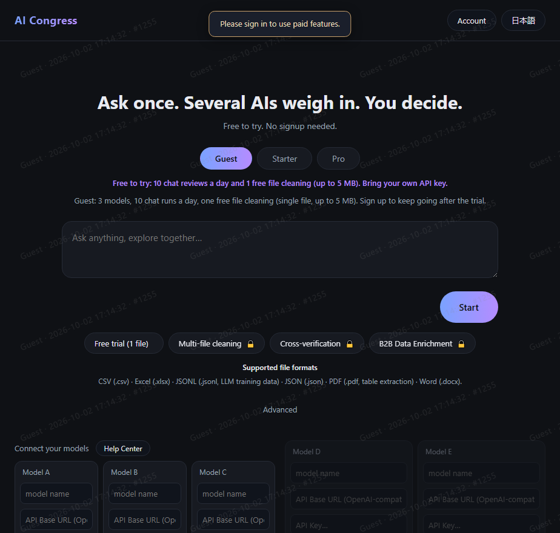
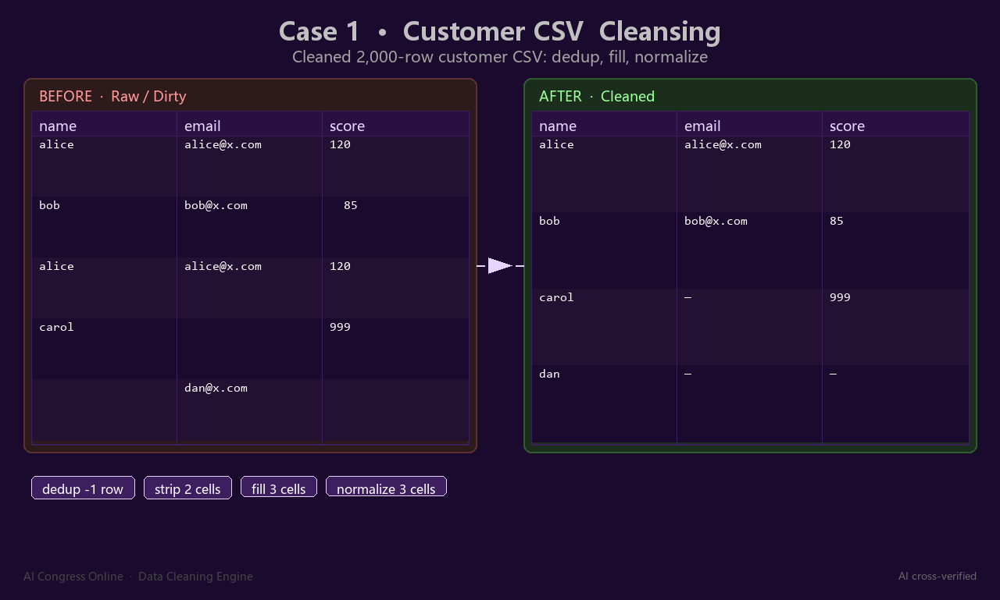
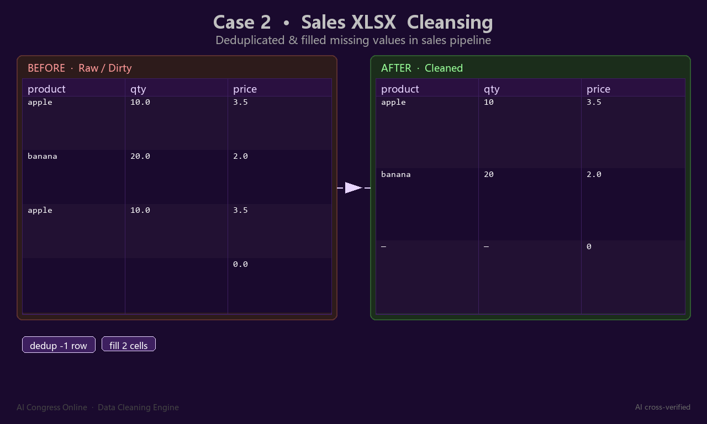
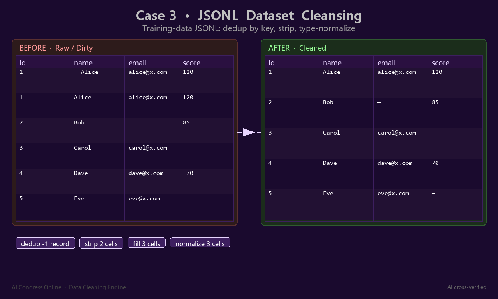
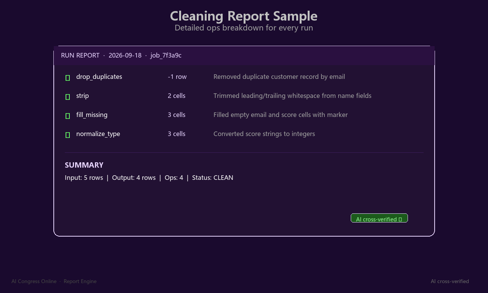

# AI Congress — Ask once. Several AIs weigh in. You decide.

**AI Congress is a live cloud service: a data-cleaning and multi-AI collaboration platform. Ask one question and several AI models weigh in; run cross-verified cleaning on CSV / Excel / JSONL / JSON / PDF / Word files — free to try, no signup needed. Try it now at [aicongressonline.com](https://aicongressonline.com).**

This is a **live product**, not a demo or a mockup — every screenshot in this repository is a real capture of the running service.

> **Repository status.** This repository is a **portfolio / showcase** for the AI Congress product: documentation, screenshots and the publisher's portfolio PDF. **No source code and no deployment configuration are published here.** The product is a commercial SaaS with production hardening (Cloudflare WAF + Turnstile bot checks + signed API routes + JS anti-scraping on the client), and publishing any of it would defeat that hardening. The real product is one click away: [aicongressonline.com](https://aicongressonline.com).

## What it is

- **Multi-AI cross-verification** — ask once, several models weigh in on the same question, and you decide. Run cross-verification on data-cleaning results so you are not trusting one model's judgment alone.
- **File cleaning & extraction engine** — CSV, Excel (.xlsx), JSONL (LLM training data), JSON, PDF (table extraction), Word (.docx). Built-in cleaning ops: dedup, strip, fill missing, normalize types — each run produces a detailed, auditable report.
- **Bring your own key** — connect your own model endpoints (OpenAI-compatible API base URL + key). Your keys stay in your browser — the platform never stores them.
- **Free to try, no signup** — 10 chat reviews a day and 1 free file cleaning (up to 5 MB) with your own API key; a no-signup Guest trial covers 3 models, 10 chat runs a day and one free file cleaning.
- **Plans** — Guest / Starter / Pro tiers; paid features include multi-file cleaning, cross-verification ($3 / run) and B2B data enrichment ($3 / run).

## Screenshots

### Live website (aicongressonline.com)

### Cleaning engine, real runs

| Case 1 · Customer CSV cleansing | Case 2 · Excel cleansing | Case 3 · JSONL (LLM training data) |
|---|---|---|
|  |  |  |

### Report engine — every run is auditable

## Portfolio

The publisher's full portfolio deck for this product: **[portfolio-aicongress.pdf](portfolio-aicongress.pdf)** — case studies, capability overview and platform walkthrough.

## Privacy & security

- **Live production hardening**: Cloudflare-fronted (WAF + Turnstile), HTTPS-only, signed API routes, security headers (nosniff / DENY / HSTS / CSP).
- **BYOK privacy**: your model API keys are entered in your browser and are **not** stored on the platform server.
- The platform's privacy policy is displayed in-app before any paid or upload flow.

## Building / provenance

- The product is **live** (see the website); version lineage and release records are maintained in the publisher's private ledger.
- Stack overview (public-level, no config): FastAPI backend, single-page client, SQLite storage at current scale, containerized deployment behind Cloudflare.

## License

Evaluation license — see [LICENSE](LICENSE). This repository is a showcase: documentation and screenshots may be referenced for portfolio purposes; **commercial redistribution of any artifact is not permitted**. The service itself is offered at [aicongressonline.com](https://aicongressonline.com).

## Disclaimer

AI Congress is a data-processing and AI-assisted analysis tool, **not** a guarantee of correctness for your downstream reports or decisions. Cleaning and cross-verification results should be spot-checked before use in anything that matters. Model outputs may contain errors — that is why the platform offers cross-verification, and why you always decide.